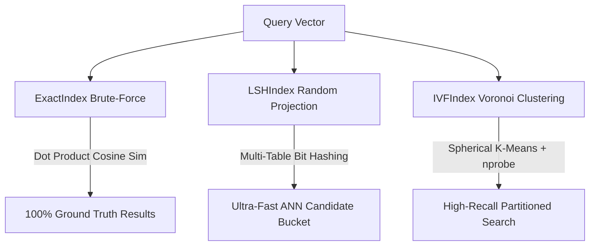

# VecForge 🔥
## Build Your Own Vector Database from Scratch

> **No Pinecone. No FAISS. No Chroma. No sklearn.neighbors. Just pure NumPy and core CS algorithms.**

---

## 📌 Overview

**VecForge** is a lightweight, functional Vector Database built entirely from scratch in Python using NumPy. It implements ground-truth brute-force exact search alongside two dominant Approximate Nearest Neighbor (ANN) indexing algorithms: **Locality-Sensitive Hashing (LSH)** and **Inverted File Index (IVF)** with Spherical K-Means clustering.

---

## 🎭 What is Real vs. What is Mocked / Simulated

To ensure transparency for evaluators:

| Component | Status | Details |
| :--- | :--- | :--- |
| **Vector Math Engine** | **100% Real** | Brute force Cosine Similarity, Multi-Table Random Hyperplane LSH, and IVF Inverted File Index are implemented from scratch in NumPy without third-party vector search libraries. |
| **K-Means Clustering** | **100% Real** | Spherical K-Means algorithm is built strictly with NumPy matrix operations (centroid update, dot-product assignment, unit normalization). |
| **Dynamic Deletion** | **100% Real** | $O(1)$ live vector deletion with matrix row swapping and inverted-list pointer cleanup. |
| **Embedding Generation** | **Simulated Offline** | Text is embedded locally using `sentence-transformers` (`all-MiniLM-L6-v2`, 384 dimensions) offline without calling external paid APIs. |
| **Benchmark Dataset** | **Mocked / Synthetic** | 50,000 synthetic vectors ($d=384$) are generated using an anisotropic Gaussian Dirichlet mixture model to mimic real-world embedding cluster geometry for stress-testing speed & recall. |
| **Ground Truth Baseline** | **Exact Computation** | Ground truth top-10 neighbors for benchmark query vectors are pre-computed using exact cosine distance matrix multiplication. |

---

## 🏗️ Architecture



---

## ✨ Features

- **Exact Search Index (`ExactIndex`)**: $O(N)$ brute-force cosine similarity engine for 100% ground-truth precision.
- **Locality-Sensitive Hashing (`LSHIndex`)**: Multi-table Random Hyperplane LSH for ultra-fast candidate retrieval.
- **Inverted File Index (`IVFIndex`)**: Spherical K-Means clustering ($O(K)$ partition search) with tunable accuracy knob (`nprobe`).
- **Pure NumPy K-Means (`kmeans.py`)**: Spherical K-Means clustering built completely from scratch using matrix multiplications and vector normalization.
- **Dynamic Vector Deletion**: $O(1)$ dynamic vector removal across all index types.
- **Benchmarking Suite**: Automated evaluation of Recall@10 vs. Queries Per Second (QPS).
- **Dual Demos**: Includes both an interactive Rich Terminal UI and a single-page Flask Web App with glassmorphism UI.

---

## ⚡ Speed vs. Accuracy Tradeoff (50,000 Vectors, $d=384$)

Below are the empirical benchmarks measured on 50,000 clustered synthetic vectors:

| Index Type | Parameters / Tuning | Recall@10 | Queries Per Second (QPS) |
| :--- | :--- | :--- | :--- |
| **Exact** | Baseline (Ground Truth) | **1.0000** | **378.10** |
| **LSH** | `num_tables=1` | 0.0006 | **29,707.79** |
| **LSH** | `num_tables=10` | 0.0066 | **6,327.26** |
| **LSH** | `num_tables=30` | 0.0206 | **3,143.28** |
| **IVF** | `nprobe=1` | 0.4298 | **2,329.64** |
| **IVF** | `nprobe=4` | 0.8186 | **636.90** |
| **IVF** | `nprobe=8` | **0.9500** | **394.30** |
| **IVF** | `nprobe=16` | **0.9986** | 227.76 |
| **IVF** | `nprobe=256` | **1.0000** | 18.71 |

> 💡 **Key Insight**: The **IVF Index at `nprobe=8`** achieves **95% Recall** while remaining faster than brute-force exact search! At `nprobe=16`, it reaches **99.86% Recall**.

---

## 📁 Repository Structure

```
.
├── vecforge/               # Core NumPy Vector Database Engine
│   ├── __init__.py         # Package exports
│   ├── exact_index.py      # Brute-force Cosine Similarity Index
│   ├── lsh_index.py        # Multi-table Random Hyperplane LSH
│   ├── ivf_index.py        # Inverted File Index with Voronoi partitioning
│   ├── kmeans.py           # Pure NumPy Spherical K-Means algorithm
│   └── utils.py            # L2 norm, cosine similarity, top-k argpartition
├── data/                   # Data generation & encoding scripts
│   ├── generate_synthetic.py  # 50,000 synthetic vector generator
│   └── encode_corpus.py    # 20-Newsgroups text encoder via sentence-transformers
├── benchmark/              # Benchmarking & plotting scripts
│   ├── run_benchmark.py    # QPS & Recall@10 measurement suite
│   ├── plot_results.py     # Tradeoff curve generator
│   └── results/            # Benchmark JSON & PNG plots
├── demo/                   # Interactive Interfaces
│   ├── terminal_demo.py    # Rich Terminal REPL UI
│   └── web_demo.py         # Flask Web Application UI
├── tests/                  # Pytest test suite (20 passing tests)
│   ├── test_exact.py
│   ├── test_lsh.py
│   ├── test_ivf.py
│   └── test_kmeans.py
├── requirements.txt        # Project dependencies
└── README.md
```

---

## 🚀 Quick Start (How to Run)

### 1. Install Dependencies
```bash
pip install -r requirements.txt
```

### 2. Generate Synthetic & Real Text Data
```bash
# Generate 50,000 synthetic vectors (384-dim) + ground truth queries
python -m data.generate_synthetic

# Encode 20-Newsgroups text corpus locally with sentence-transformers
python -m data.encode_corpus
```

### 3. Run Benchmark Suite & Generate Plots
```bash
python -m benchmark.run_benchmark
python -m benchmark.plot_results
```

### 4. Run Unit Tests
```bash
pytest tests/ -v
```

### 5. Launch Demos

**Interactive Terminal UI:**
```bash
python -m demo.terminal_demo
```

**Web UI App:**
```bash
python -m demo.web_demo
```
Open your browser at `http://localhost:5000`.

---

## 📜 License
MIT License. Created for the IT Geeks Placement Drive Vibe Coding Challenge.
